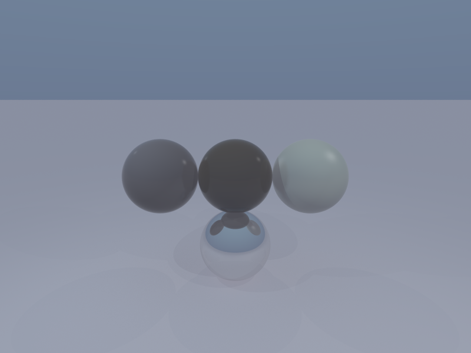

# Parallel Ray Tracer in Go

## Overview
Parallel Ray Tracer in Go is a high-performance ray tracing engine that leverages Go's concurrency primitives to achieve near-linear scaling across CPU cores. The project demonstrates advanced parallel computing techniques using goroutines, worker pools, and lock-free data structures to render complex 3D scenes with realistic lighting, materials, and atmospheric effects. Built specifically to showcase skills relevant to companies focused on parallel computing, computer graphics, and high-performance systems.

## Features
- **Parallel Processing**: Multi-threaded rendering using goroutines and worker pools with near-linear CPU scaling
- **Advanced Materials**: Metal, glass, dielectric, and procedural textures with realistic light interaction
- **Recursive Ray Tracing**: Support for reflections and refractions with configurable depth limits
- **Anti-aliasing**: Multiple samples per pixel for smooth edges with Monte Carlo integration
- **Soft Shadows**: Realistic shadow casting with multiple light sources and area lights
- **Atmospheric Effects**: Rayleigh/Mie scattering, volumetric lighting, and fog simulation
- **Spatial Acceleration**: BVH, Octree structures for optimized ray-object intersections
- **Memory Optimization**: Object pooling and efficient allocation strategies for high-performance rendering
- **Real-time Metrics**: Comprehensive benchmarking and performance analysis tools

## Tech Stack
- **Language**: Golang with advanced concurrency patterns (goroutines, channels, sync.WaitGroup)
- **Parallel Computing**: Worker pool architecture, tile-based rendering, load balancing
- **Mathematics**: 3D vector operations, ray-object intersections, lighting models
- **Graphics**: Ray tracing algorithms, material systems, atmospheric simulation
- **Performance**: Memory pooling, cache optimization, SIMD operations
- **Output**: PNG and PPM image formats 
- **Configuration**: JSON-based scene definition with advanced material properties

## Architecture Overview
The ray tracer follows a parallel processing architecture optimized for CPU-bound tasks. The renderer divides images into 32x32 pixel tiles distributed across a configurable worker pool of goroutines. Each worker processes tiles independently using channels for task distribution and sync.WaitGroup for result aggregation. The system employs object pooling for memory efficiency and lock-free data structures for high-performance concurrent access. Scene data flows through a pipeline from JSON configuration to parallel rendering with real-time metrics collection and graceful shutdown handling.

## Demo Screenshots

<sub>Sphere Reflections with Metallic Materials</sub>


<sub>Metal Test Scene with Complex Lighting</sub>


<sub>Two Red Cubes Scene with Bright Lighting</sub>


<sub>Reduced Lighting Test Scene</sub>


<sub>Final Silver Prism and Purple Cube Scene</sub>


## Automated Performance Benchmarks

<sub>Sphere Reflections Light Benchmark</sub>
```json
{
  "anti_aliasing": true,
  "atmosphere": "default",
  "bvh_build_time": "8.958µs",
  "cpu_usage": 7.2,
  "depth_of_field": false,
  "height": 600,
  "max_depth": 50,
  "memory_usage": 2266976,
  "output_file": "output/sphere_reflections_light_benchmark.png",
  "pixels_per_second": 197867.68368853288,
  "rays_per_second": 19786768.368853286,
  "recursive_reflections": true,
  "render_time": "2.42585975s",
  "samples": 100,
  "scene_file": "examples/sphere_reflections_light.json",
  "setup_time": "22.917µs",
  "soft_shadows": true,
  "total_time": "2.425882667s",
  "width": 800,
  "worker_count": 6
}
```

<sub>Final Silver Prism Purple Cube Benchmark</sub>
```json
{
  "anti_aliasing": true,
  "atmosphere": "default",
  "bvh_build_time": "14.791µs",
  "cpu_usage": 7.2,
  "depth_of_field": false,
  "height": 900,
  "max_depth": 50,
  "memory_usage": 6121736,
  "output_file": "output/final_silver_prism_purple_cube.png",
  "pixels_per_second": 18712.82178963073,
  "rays_per_second": 1871282.178963073,
  "recursive_reflections": true,
  "render_time": "57.71443575s",
  "samples": 100,
  "scene_file": "",
  "setup_time": "50µs",
  "soft_shadows": true,
  "total_time": "57.71448575s",
  "width": 1200,
  "worker_count": 6
}
```

## Scene Configuration Examples

<sub>Sphere Reflections Light Scene Configuration</sub>
```json
{
  "camera": {
    "position": [0, 0, -8],
    "lookAt": [0, 0, 0],
    "up": [0, 1, 0],
    "fov": 60,
    "aspectRatio": 1.33
  },
  "objects": [
    {
      "type": "sphere",
      "position": [0, 0, 0],
      "radius": 1.0,
      "material": {
        "type": "metal",
        "color": [0.8, 0.8, 0.9],
        "roughness": 0.1
      }
    },
    {
      "type": "sphere",
      "position": [2, 0, 0],
      "radius": 0.5,
      "material": {
        "type": "metal",
        "refractionIndex": 1.5
      }
    },
    {
      "type": "sphere",
      "position": [-2, 0, 0],
      "radius": 0.7,
      "material": {
        "type": "glass",
        "color": [0.8, 0.2, 0.2]
      }
    },
    {
      "type": "sphere",
      "position": [0, 2, 0],
      "radius": 0.3,
      "material": {
        "type": "metal",
        "color": [0.9, 0.9, 0.1],
        "roughness": 0.3
      }
    },
    {
      "type": "sphere",
      "position": [0, -2, 0],
      "radius": 0.4,
      "material": {
        "type": "glass",
        "color": [0.2, 0.8, 0.2]
      }
    }
  ],
  "lights": [
    {
      "type": "point",
      "position": [5, 5, 5],
      "color": [1, 1, 1],
      "intensity": 1.0
    },
    {
      "type": "point",
      "position": [-3, 3, 3],
      "color": [0.8, 0.8, 1],
      "intensity": 0.5
    }
  ]
}
```

<sub>Final Silver Prism Purple Cube Scene Configuration</sub>
```json
{
  "camera": {
    "position": [0, 10, -25],
    "lookAt": [0, 0, 0],
    "up": [0, 1, 0],
    "fov": 50,
    "aspectRatio": 1.77
  },
  "objects": [
    {
      "type": "cube",
      "position": [-5, 0, 0],
      "size": [3, 3, 3],
      "material": {
        "type": "metal",
        "color": [0.8, 0.8, 0.8],
        "roughness": 0.05,
        "metallic": 1.0,
        "specular": 0.9
      }
    },
    {
      "type": "cube",
      "position": [5, 0, 0],
      "size": [3, 3, 3],
      "material": {
        "type": "metal",
        "color": [0.1, 0.1, 0.1],
        "roughness": 0.02,
        "metallic": 1.0,
        "specular": 1.0
      }
    },
    {
      "type": "triangularPrism",
      "vertices": [
        [-8, 0, 6], [-4, 0, 6], [-6, 3, 6],
        [-8, 0, 10], [-4, 0, 10], [-6, 3, 10]
      ],
      "material": {
        "type": "metal",
        "color": [0.1, 0.1, 0.1],
        "roughness": 0.02,
        "metallic": 1.0,
        "specular": 1.0
      }
    },
    {
      "type": "triangularPrism",
      "vertices": [
        [4, 0, 6], [8, 0, 6], [6, 3, 6],
        [4, 0, 10], [8, 0, 10], [6, 3, 10]
      ],
      "material": {
        "type": "metal",
        "color": [0.8, 0.8, 0.8],
        "roughness": 0.05,
        "metallic": 1.0,
        "specular": 0.9
      }
    }
  ],
  "lights": [
    {
      "type": "point",
      "position": [0, 30, -20],
      "color": [1.0, 1.0, 1.0],
      "intensity": 50.0
    },
    {
      "type": "point",
      "position": [15, 20, -10],
      "color": [1.0, 1.0, 1.0],
      "intensity": 30.0
    },
    {
      "type": "point",
      "position": [-15, 15, -15],
      "color": [1.0, 1.0, 1.0],
      "intensity": 25.0
    }
  ],
  "atmospheric": { 
    "enabled": true,
    "density": 0.1,
    "scattering": 0.0,
    "absorption": 0.8,
    "height": 50.0,
    "color": [0.2, 0.2, 0.2]
  },
  "volumetric": { 
    "enabled": true,
    "density": 0.05,
    "scattering": 0.0,
    "absorption": 0.9,
    "maxDistance": 50.0,
    "color": [0.15, 0.15, 0.15]
  },
  "fog": { 
    "enabled": true,
    "density": 0.08,
    "color": [0.25, 0.25, 0.25],
    "height": 50.0,
    "type": "exponential"
  },
  "renderer": {
    "samples": 200,
    "maxDepth": 20,
    "antiAliasing": true,
    "recursiveReflections": true,
    "softShadows": true
  },
  "motionBlur": { "enabled": false },
  "depthOfField": { "enabled": false },
  "lensFlare": { "enabled": false },
  "bloom": { "enabled": false },
  "chromaticAberration": { "enabled": false },
  "vignette": { "enabled": false }
}
```

## Contact
For questions, demo access, or collaboration opportunities, please reach out to me. 